<div align="center">



# ⚡ Awesome Transaction Monitoring

<p align="center">
  <strong>Curated ecosystem of SaaS platforms, open-source decision engines, AML typologies, and ML fraud detection frameworks.</strong>
</p>

<p align="center">
  <a href="https://github.com/ishandutta2007/Awesome-Awesome-Awesome"></a>
  <a href="https://discord.gg/jc4xtF58Ve"></a>
  <a href="https://github.com/ishandutta2007/Awesome-Transaction-Monitoring/stargazers"></a>
  <a href="https://github.com/ishandutta2007/Awesome-Transaction-Monitoring/forks"></a>
  <a href="https://github.com/ishandutta2007/Awesome-Transaction-Monitoring/blob/main/LICENSE"></a>
  <a href="https://github.com/ishandutta2007/Awesome-Transaction-Monitoring/pulls"></a>
  <a href="https://github.com/ishandutta2007"></a>
</p>

<p align="center">
  <em>Anti-Money Laundering (AML) • Real-Time Fraud Prevention • Sanctions & PEP Screening • Behavioral Analytics • Case Management • SAR/STR Compliance</em>
</p>

<p align="center">
  <sub>Last updated: August 2026</sub>
</p>

</div>

---

## 📌 Overview

**Transaction Monitoring (TM)** is the real-time or automated batch analysis of financial transactions to identify suspicious patterns indicating money laundering, terrorist financing, fraud, sanctions evasion, or tax fraud. Modern transaction monitoring systems combine **deterministic rule engines (FATF typologies)**, **graph network analysis**, **unsupervised anomaly detection**, and **AI-powered investigative copilots** to ensure regulatory compliance (FinCEN, FATF, FCA, BaFin, MAS) while minimizing analyst alert fatigue.

This repository is a comprehensive and SEO-optimized index of **enterprise SaaS platforms**, **open-source decision engines**, **datasets & simulators**, and **architectural blueprints** for financial institutions, fintech compliance officers, ML engineers, and fraud analysts.

---

## 📚 Table of Contents
- [🛡️ SaaS/Hosted Platforms](#️-saashosted-platforms)
- [⚡ Open-Source GitHub Projects](#-open-source-github-projects)
- [🧩 Architecture & Building Blocks](#-architecture--building-blocks)
- [🤝 How to Contribute](#-how-to-contribute)
- [📈 Star History](#-star-history)
- [⚖️ Disclaimer](#️-disclaimer)

---

## 🛡️ SaaS/Hosted Platforms

Top enterprise and startup-focused SaaS platforms for AML transaction monitoring, sanctions/PEP screening, and financial crime risk management, sorted by company size (valuation / revenue, descending):

| Platform | Valuation / Revenue | Capabilities | Starting Pricing | Free Tier / Free Trial Limits |
| :--- | :--- | :--- | :--- | :--- |
| **[FICO TONBELLER](https://www.fico.com/)** | **~$24 Billion** Market Cap (Public: NYSE: FICO) / ~$2.4B ARR | Established AML and compliance suite (FICO Siron AML) covering transaction monitoring, KYC, and financial crime risk management. | **~$180,000 / year** base enterprise contract for the compliance & decision management suite | **30-day guided pilot / POC**: Evaluation sandbox with custom rule calibration and typology simulation for enterprise prospects. |
| **[NICE Actimize](https://www.niceactimize.com/)** | **~$6.3 Billion** Market Cap (NICE Group) / ~$1.5B–$2B Unit Valuation | Enterprise financial crime platform widely used by Tier 1/2 banks for AML transaction monitoring, fraud detection, and case management with deep core-banking integrations. | **~$50,000 / year** entry tier for mid-market/essentials deployments (scaling to $200k–$500k+ for full enterprise suite) | **30-day guided enterprise POC**: Dedicated sandbox environment with integration testing for qualified institutions upon request. |
| **[SAS Anti-Money Laundering](https://www.sas.com/)** | **~$3.0 Billion** Annual Revenue (SAS Institute) | Comprehensive AML suite from SAS offering transaction monitoring, customer due diligence, and regulatory reporting on the SAS Viya analytics engine. | **~$100,000 / year** base enterprise subscription on SAS Cloud / Viya platform | **14-day SAS Viya free trial**: Includes up to 1GB data upload, preloaded analytical models, and up to 5 user collaboration seats. |
| **[Feedzai](https://www.feedzai.com/)** | **~$2.0 Billion** Valuation (Unicorn, VC-backed) | AI-powered risk management platform combining fraud and AML transaction monitoring with strong model explainability for banks and payment institutions. | **~$60,000 / year** base SaaS subscription (available via AWS Marketplace) | **60-day targeted POC trial**: Available for qualified financial institutions alongside a complimentary risk intelligence briefing. |
| **[Featurespace](https://www.featurespace.com/)** | **~$925 Million** Acquisition (Acquired by Visa) | Adaptive behavioral analytics platform (ARIC Risk Hub) specializing in real-time fraud and financial crime detection using machine learning. | **~$75,000 / year** base SaaS contract (available via AWS Marketplace private offer) | **30-day POC sandbox**: Tailored testing environment with simulated transaction streams for enterprise evaluation. |
| **[Unit21](https://www.unit21.ai/)** | **~$621 Million** Valuation (Series C) | No-code/low-code transaction monitoring, alert triage, and case management platform popular with fintech compliance teams. | **~$33,000 / year** (~$2,750/month) base contract for entry transaction volume tiers | **30-day guided POC sandbox**: Access with synthetic financial crime datasets for qualified prospective teams upon sales request. |
| **[SEON](https://seon.io/)** | **~$500+ Million** Valuation (Series B) | Fraud prevention and AML platform combining device intelligence, digital footprint analysis, and real-time transaction monitoring. | **$699 / month** (Starter/Pro tier with 10+ QPS) | **Forever Free plan**: Up to 2,000 API calls/month (2 QPS rate limit, email support) or 14-day full-feature free trial (no credit card required). |
| **[ComplyAdvantage](https://complyadvantage.com/)** | **~$350 Million** Valuation (Series C / $88M+ funding) | AI-native AML platform offering real-time sanctions/PEP screening, transaction monitoring, and risk intelligence. | **$99 / month** (billed annually at $1,188/yr) or $119/mo (billed monthly) for up to 100 monitored entities | **ComplyLaunch program**: 12 months free access for eligible early-stage startups; standard plans offer guided interactive sandbox demo. |
| **[Lucinity](https://www.lucinity.com/)** | **~$100 Million** Valuation (Series B) | Modern AML and transaction monitoring platform focused on AI-assisted investigations, actor-centric profiles, and reduced false positives. | **~$54,000 / year** (~$4,500/month) base subscription or SLA-based completed work pricing | **14-day interactive demo sandbox**: Preloaded with realistic AML scenario data to test alert handling and Copilot investigation tools. |
| **[Flagright](https://www.flagright.com/)** | **~$25 Million** Valuation (YC-backed) | Real-time AML and fraud prevention platform designed for fintechs and payment companies with API-first architecture. | **~$30,000 / year** (~$2,500/month) base volume tier | **Startup Program**: 1st year free (12 months full platform access) for eligible early-stage startups; or 14-day guided POC trial upon request. |

---

## ⚡ Open-Source GitHub Projects

Curated open-source decision engines, rules evaluation systems, anomaly detection frameworks, data simulators, and sanctions screening pipelines, sorted by GitHub star count (descending):

- **[PyOD (Python Outlier Detection)](https://github.com/yzhao062/pyod)** [](https://github.com/yzhao062/pyod/stargazers)  
  Comprehensive and scalable Python toolkit for detecting outlier and anomalous financial transactions across 40+ algorithms (Isolation Forest, ECOD, COPOD, AutoEncoders, VAEs, and GNNs).

- **[CEL-Go (Common Expression Language)](https://github.com/cel-expr/cel-go)** [](https://github.com/cel-expr/cel-go/stargazers)  
  Fast, portable, and non-Turing complete expression evaluation engine in Go used to execute high-throughput, dynamic AML transaction monitoring rules and typology conditions in sub-millisecond latencies.

- **[Zen Business Rules](https://github.com/gorules/zen)** [](https://github.com/gorules/zen/stargazers)  
  High-performance open-source business rules engine written in Rust with bindings for Go, Python, and NodeJS, engineered for real-time transaction scoring, decision tables, and compliance graphs.

- **[FINOS Legend](https://github.com/finos/legend)** [](https://github.com/finos/legend/stargazers)  
  Comprehensive financial data modeling, data governance, and regulatory compliance platform originally developed by Goldman Sachs and open-sourced under the Fintech Open Source Foundation (FINOS).

- **[OpenSanctions](https://github.com/opensanctions/opensanctions)** [](https://github.com/opensanctions/opensanctions/stargazers)  
  Open-source data pipeline and international intelligence database consolidating global sanctions, politically exposed persons (PEPs), and financial crime lists for continuous AML screening.

- **[Fraud Detection Handbook](https://github.com/Fraud-Detection-Handbook/fraud-detection-handbook)** [](https://github.com/Fraud-Detection-Handbook/fraud-detection-handbook/stargazers)  
  Reproducible, open-source guide and Python codebase covering end-to-end machine learning pipelines, imbalanced class handling, streaming simulation, and benchmark models for payment fraud detection.

- **[Marble](https://github.com/checkmarble/marble)** [](https://github.com/checkmarble/marble/stargazers)  
  Modern open-source real-time decision engine for fraud and AML, supporting streaming transaction monitoring, sanctions/PEP screening, and AI-assisted case investigations with self-hosted deployments.

- **[IBM AMLSim](https://github.com/IBM/AMLSim)** [](https://github.com/IBM/AMLSim/stargazers)  
  Agent-based transaction simulation engine created by IBM Research to generate realistic synthetic banking transaction datasets embedded with complex money laundering typologies (fan-out/fan-in, cycles, bipartite graphs).

- **[Yente (OpenSanctions API)](https://github.com/opensanctions/yente)** [](https://github.com/opensanctions/yente/stargazers)  
  Fast, self-hosted open-source matching engine and entity resolution REST API for OpenSanctions, powering real-time customer onboarding KYC and transaction screening.

- **[Jube AML & Fraud](https://github.com/jube-home/aml-fraud-transaction-monitoring)** [](https://github.com/jube-home/aml-fraud-transaction-monitoring/stargazers)  
  Fully open-source (AGPLv3) real-time transaction monitoring platform combining deterministic rules, ML scoring, alert routing, and investigation case management.

- **[Awesome-FCC](https://github.com/SKR-35/Awesome-FCC)** [](https://github.com/SKR-35/Awesome-FCC/stargazers)  
  Curated collection of open resources, regulatory guidelines, datasets, and tools for Financial Crime Compliance (FCC), AML, and Sanctions.

- **[Osprey](https://github.com/opensource-finance/osprey)** [](https://github.com/opensource-finance/osprey/stargazers)  
  Lightweight open-source transaction monitoring microservice utilizing CEL rules and FATF typologies, deployable as a single Go binary.

---

## 🧩 Architecture & Building Blocks

For teams building self-hosted or custom transaction monitoring architectures:

```
                      ┌─────────────────────────────────────────┐
                      │     Ingestion & Event Streaming         │
                      │   (Kafka / Redpanda / AWS Kinesis)      │
                      └────────────────────┬────────────────────┘
                                           │
                                           ▼
                      ┌─────────────────────────────────────────┐
                      │    Real-Time Decision & Rules Engine    │
                      │      (CEL-Go / Zen Rules / Marble)      │
                      └────────────────────┬────────────────────┘
                                           │
                     ┌─────────────────────┴─────────────────────┐
                     ▼                                           ▼
      ┌──────────────────────────────┐            ┌──────────────────────────────┐
      │   Machine Learning & Anomaly │            │  Sanctions & Entity Match    │
      │  (PyOD / XGBoost / Graph ML) │            │   (Yente / OpenSanctions)    │
      └──────────────┬───────────────┘            └──────────────┬───────────────┘
                     │                                           │
                     └─────────────────────┬─────────────────────┘
                                           ▼
                      ┌─────────────────────────────────────────┐
                      │    Alert Aggregation & Case Management  │
                      │    (PostgreSQL / Elasticsearch / SAR)   │
                      └─────────────────────────────────────────┘
```

- **Event Streaming & Ingestion**: Apache Kafka, Redpanda, or Apache Flink for sub-second streaming payment event evaluation.
- **Rules Execution**: CEL (Common Expression Language) or Zen Rule Engine for rapid, auditor-friendly policy adjustments.
- **Graph & Anomaly Scoring**: Neo4j, NetworkX, PyOD, and SHAP explainability pipelines for identifying structuring, layering, and circular money flows.
- **Entity Resolution**: Levenshtein/Jaro-Winkler fuzzy matching against sanctions and Politically Exposed Persons (PEPs) databases via Yente/OpenSanctions.

---

## 🤝 How to Contribute

Contributions from compliance practitioners, fraud data scientists, and developers are welcome!

1. 🍴 Fork the repository.
2. 🌿 Create a new branch (`git checkout -b feature/add-platform`).
3. 📝 Add/edit entries in [`README.md`](file:///C:/Users/ishan/Documents/Projects/Awesome-Transaction-Monitoring/README.md) following the existing tabular or social badge format.
4. 🔗 Include official links, factual descriptions, and verify transparent pricing / star links.
5. 🚀 Submit a Pull Request with a clear summary of your changes.

---

## 📈 Star History

[](https://star-history.dera.page/#ishandutta2007/Awesome-Transaction-Monitoring&type=date&legend=top-left)

---

## ⚖️ Disclaimer

- This repository is a **community-curated index** for informational and research purposes only and does not constitute formal legal, regulatory, or financial advice.
- Production transaction monitoring implementations are subject to stringent jurisdictional regulations (e.g., USA PATRIOT Act, FinCEN BSA, EU 6AMLD, FATF Recommendations) and model risk management governance (SR 11-7). Always consult with qualified legal and compliance officers before deploying compliance systems.

---

<div align="center">
  <sub>Curated with ❤️ by <a href="https://github.com/ishandutta2007">Ishan Dutta</a> and the open-source compliance community.</sub>
</div>